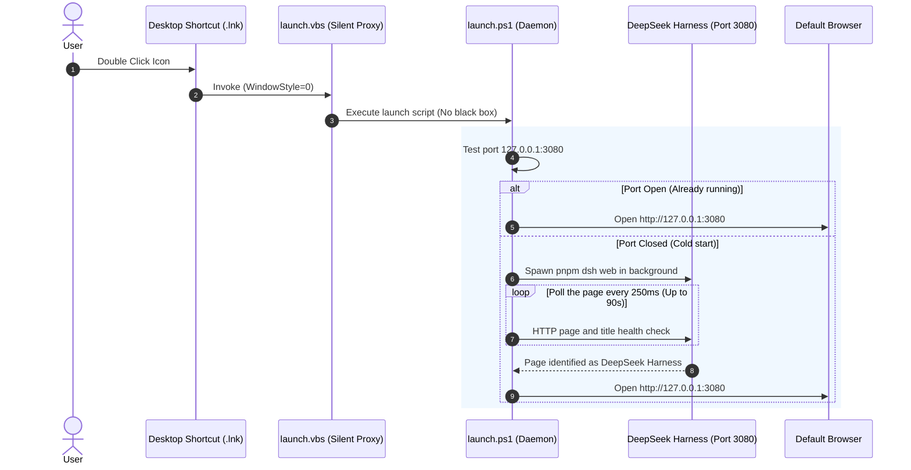

# DeepSeek Harness Desktop Launcher 🚀

<div align="center">


### Native-like Windows Desktop Launcher & Background Daemon for DeepSeek Harness

[](LICENSE)
[]()
[]()
[]()

English | [中文文档](README.zh.md)

</div>

---

## 🌟 Highlights

- 🎯 **Native App Desktop Experience**: Double click the desktop icon to launch DeepSeek Harness Web UI directly — no terminal navigation or manual URL input required.
- 🛡️ **Smart Single-Instance Daemon**:
  - **Cold Start**: Starts `dsh web` quietly in the background, health-checks port 3080, and automatically opens your default browser the millisecond it is ready.
  - **Hot Activation**: If the server is already active, instantly opens or focuses the browser tab without spawning duplicate processes or causing port conflicts.
- 🪟 **Zero Console Flicker**: Engineered with VBScript + hidden PowerShell dispatching to eliminate ugly terminal black boxes.
- 🎨 **Pixel-Perfect Official Icon**: Compiled directly from DeepSeek's official whale/dolphin vector SVG into a multi-resolution (16x16 to 256x256) Windows 11 native `.ico` icon.
- ⚡ **Auto Environment Detection**: Intelligently locates your local clone (`D:\Projects\deepseek-harness`, `pnpm dsh web`) or global `npx @deepseek-ai/dsh web`.
- 🛑 **Safe One-Click Control**: `stop.bat` terminates only launcher-tracked or positively identified `dsh web` processes; it never kills an unrelated port owner.
- 🔒 **Cold-Start Race Protection**: Rapid repeated clicks still produce only one server instance.
- ✅ **CI & Releases**: Windows validation runs on every push and PR; a `v*` tag packages the launcher and creates a GitHub Release.

---

## 📦 Directory Structure

```text
deepseek-harness-launcher/
├── assets/
│   ├── logo.svg              # DeepSeek official vector logo
│   ├── app.png               # High-res rendered PNG
│   ├── app.ico               # Windows native multi-resolution icon (16~256px)
│   └── icon_render.html      # Icon HTML template
├── scripts/
│   ├── build_icon.py         # Icon compiler script
│   ├── launch.ps1            # Core startup & port polling daemon
│   ├── launch.vbs            # Silent launcher wrapper
│   ├── stop.ps1              # Process terminator script
│   ├── install.ps1           # Desktop shortcut installer
│   └── uninstall.ps1         # Cleanup & uninstaller
├── tests/
│   └── verify.ps1            # Script, config, icon, and installer checks
├── .github/workflows/        # Windows CI and tag-based releases
├── config.json               # Launcher configuration (ports/paths/commands)
├── install.bat               # Double-click one-click installer
├── stop.bat                  # Double-click to stop background server
├── uninstall.bat             # Double-click to uninstall desktop shortcut
├── README.md                 # English documentation
├── README.zh.md              # Chinese documentation
├── LICENSE                   # MIT License
└── package.json              # Project metadata
```

---

## 🚀 Quick Start

### 1. Installation
In the project directory, simply double-click **`install.bat`** or run in PowerShell:

```powershell
.\install.bat
```

The installer will:
1. Detect your local DeepSeek Harness repository or global install.
2. Place a polished **`DeepSeek Harness`** shortcut on your Windows desktop.

### 2. Daily Usage
- **Launch / Open**: Double-click the **DeepSeek Harness** icon on your desktop.
- **Stop Server**: Double-click **`stop.bat`** to safely terminate the background server.
- **Uninstall**: Double-click **`uninstall.bat`** to remove the desktop shortcut.

---

## ⚙️ Configuration (`config.json`)

You can customize launcher settings in `config.json`:

```json
{
  "projectPath": "D:\\Projects\\deepseek-harness",
  "port": 3080,
  "host": "127.0.0.1",
  "command": "pnpm dsh web",
  "autoOpenBrowser": true,
  "timeoutSeconds": 90
}
```

| Parameter | Default | Description |
| :--- | :--- | :--- |
| `projectPath` | Auto-detected | Absolute path to deepseek-harness project |
| `port` | `3080` | Web UI listening port |
| `host` | `127.0.0.1` | Local bind address |
| `command` | `pnpm dsh web` | Startup command |
| `autoOpenBrowser` | `true` | Automatically open default browser when ready |
| `timeoutSeconds` | `90` | Maximum cold-start timeout before an alert |

Runtime logs and tracked-process state are stored under `logs/` (Git-ignored). The launcher verifies the returned page title before treating a listening port as DeepSeek Harness.

---

## 🔍 How It Works



---

## 📄 License

This project is licensed under the [MIT License](LICENSE).

## ✅ Local Verification

```powershell
powershell -NoProfile -ExecutionPolicy Bypass -File tests/verify.ps1
```

To include an installer/shortcut smoke test:

```powershell
powershell -NoProfile -ExecutionPolicy Bypass -File tests/verify.ps1 `
  -InstallerSmoke -HarnessProjectPath "D:\Projects\deepseek-harness"
```
