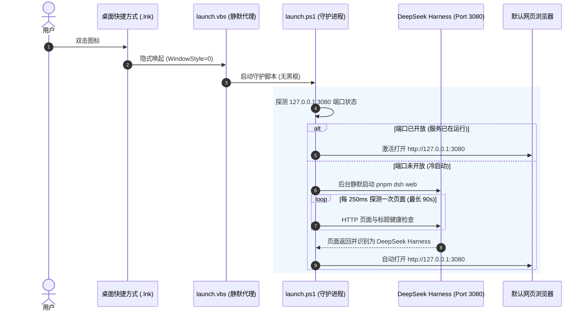

# DeepSeek Harness Desktop Launcher 🚀

<div align="center">


### 为 DeepSeek Harness 打造的原生级 Windows 桌面一键启动器与后台守护程序

[](LICENSE)
[]()
[]()
[]()

[English](README.md) | 中文文档

</div>

---

## 🌟 核心特性

- 🎯 **原生软件般的桌面体验**：一键双击桌面图标，直接唤起 DeepSeek Harness Web 页面，告别繁琐的终端命令和手动输入网址。
- 🛡️ **智能单实例守护**：
  - **未运行**：后台静默启动 `dsh web`，毫秒级轮询 3080 端口，服务就绪后秒开默认浏览器。
  - **已在运行**：直接激活浏览器页面，绝不产生重复进程或端口冲突。
- 🪟 **彻底消除命令行黑框**：采用 VBScript + 隐藏式 PowerShell 守护，启动全程无任何黑框弹窗或闪烁。
- 🎨 **官方原生矢量图标**：基于 DeepSeek 官方经典蓝白海豚/鲸鱼 Logo，多分辨率（16x16 ~ 256x256）编译生成高清 Windows 11 原生 `.ico` 桌面图标。
- ⚡ **环境自适应探测**：自动识别本地 Git 源码仓库（`D:\Projects\deepseek-harness`、`pnpm dsh web`）或全局 `npx @deepseek-ai/dsh web`。
- 🛑 **安全的一键启停**：`stop.bat` 只终止启动器记录或可明确识别为 `dsh web` 的进程；端口被其他程序占用时不会误杀。
- 🔒 **并发冷启动保护**：快速连续双击也只会启动一个服务实例。
- ✅ **自动验证与发布**：内置 Windows CI；推送 `v*` 标签即可生成 ZIP 并创建 GitHub Release。

---

## 📦 项目结构

```text
deepseek-harness-launcher/
├── assets/
│   ├── logo.svg              # DeepSeek 官方矢量 Logo
│   ├── app.png               # 高清渲染 PNG 图标
│   ├── app.ico               # Windows 原生多分辨率图标 (16~256px)
│   └── icon_render.html      # 图标渲染模版
├── scripts/
│   ├── build_icon.py         # 图标编译生成工具
│   ├── launch.ps1            # 核心启动守护逻辑（端口探测、浏览器分发）
│   ├── launch.vbs            # 静默启动封装（消除黑框）
│   ├── stop.ps1              # 一键停止后台服务
│   ├── install.ps1           # 桌面快捷方式安装向导
│   └── uninstall.ps1         # 卸载清理脚本
├── tests/
│   └── verify.ps1            # 脚本、配置、图标与安装器验证
├── .github/workflows/        # Windows CI 与标签发布工作流
├── config.json               # 启动器配置文件（端口/路径/命令）
├── install.bat               # 双击一键安装
├── stop.bat                  # 双击一键停止后台服务
├── uninstall.bat             # 双击一键卸载快捷方式
├── README.md                 # 英文说明文档
├── README.zh.md              # 中文说明文档
├── LICENSE                   # MIT 许可证
└── package.json              # 项目元数据
```

---

## 🚀 快速开始

### 1. 一键安装
在项目根目录中，直接双击运行 **`install.bat`**，或在 PowerShell 中执行：

```powershell
.\install.bat
```

安装程序将自动：
1. 探测你的 DeepSeek Harness 本地项目路径；
2. 在 Windows 桌面上生成带官方图标的 **`DeepSeek Harness`** 快捷方式。

### 2. 日常使用
- **启动/打开**：双击桌面上的 **DeepSeek Harness** 图标。
- **停止服务**：如果需要完全退出后台常驻服务，双击运行项目目录下的 **`stop.bat`**。
- **卸载清理**：双击运行 **`uninstall.bat`** 即可移除桌面图标。

---

## ⚙️ 进阶配置 (`config.json`)

你可以通过编辑根目录下的 `config.json` 来自定义启动行为：

```json
{
  "projectPath": "D:\\Projects\\deepseek-harness",
  "port": 3080,
  "host": "127.0.0.1",
  "command": "pnpm dsh web",
  "autoOpenBrowser": true,
  "timeoutSeconds": 90
}
```

| 参数 | 默认值 | 说明 |
| :--- | :--- | :--- |
| `projectPath` | 自动探测 | DeepSeek Harness 源码目录绝对路径 |
| `port` | `3080` | Web UI 监听端口 |
| `host` | `127.0.0.1` | 绑定地址 |
| `command` | `pnpm dsh web` | 启动命令（如 `pnpm dsh web --port 3080`） |
| `autoOpenBrowser` | `true` | 服务就绪后是否自动在默认浏览器中打开 |
| `timeoutSeconds` | `90` | 等待服务就绪的最长超时时间（秒） |

运行时日志和进程状态保存在项目的 `logs/` 目录中（该目录已被 Git 忽略）。启动器会检查网页标题，确认端口上的服务确实是 DeepSeek Harness 后才打开浏览器。

---

## 🔍 工作原理



---

## 🛠️ 自定义图标编译

如果你想调整图标或重新生成不同尺寸的 `.ico`：

```powershell
python scripts/build_icon.py
```

该工具利用系统内置的 Edge/Chrome 无头渲染引擎将 `assets/icon_render.html` 渲染为高清透明 PNG，并通过 Pillow 库编译为同时包含 16px、24px、32px、48px、64px、128px、256px 尺寸的 Windows 标准 `.ico` 图标。

## ✅ 本地验证

```powershell
powershell -NoProfile -ExecutionPolicy Bypass -File tests/verify.ps1
```

如需连同桌面快捷方式安装器一起做冒烟测试：

```powershell
powershell -NoProfile -ExecutionPolicy Bypass -File tests/verify.ps1 `
  -InstallerSmoke -HarnessProjectPath "D:\Projects\deepseek-harness"
```

---

## 📄 开源许可证

本项目基于 [MIT License](LICENSE) 开源。欢迎 Star、Fork 与提交 Issue/PR！
